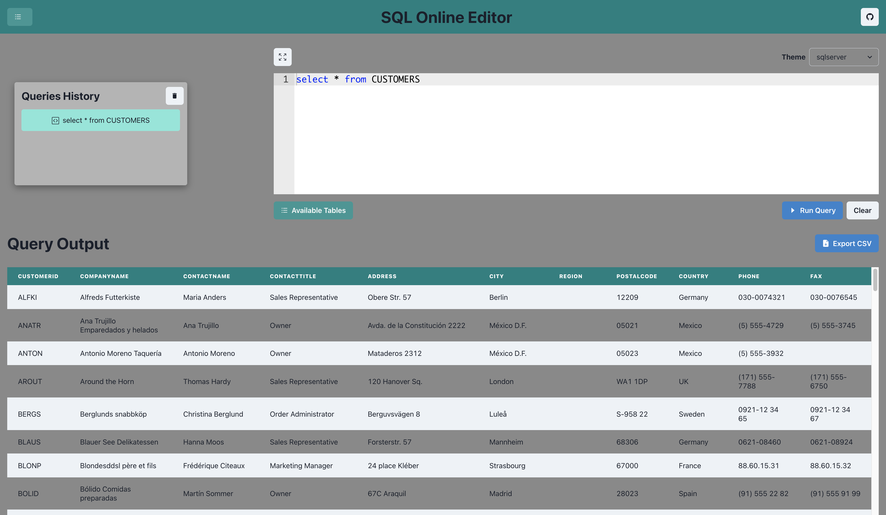
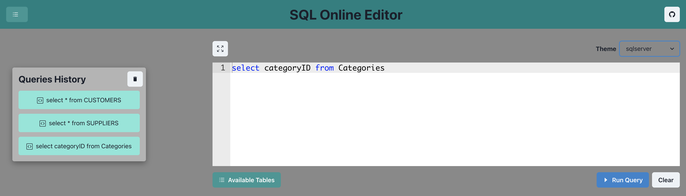
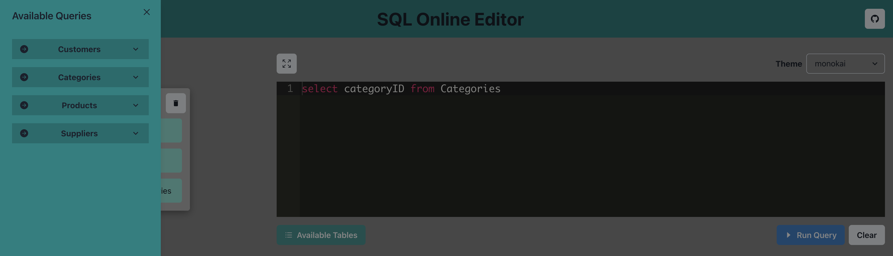
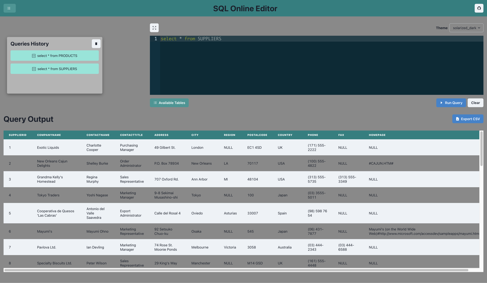
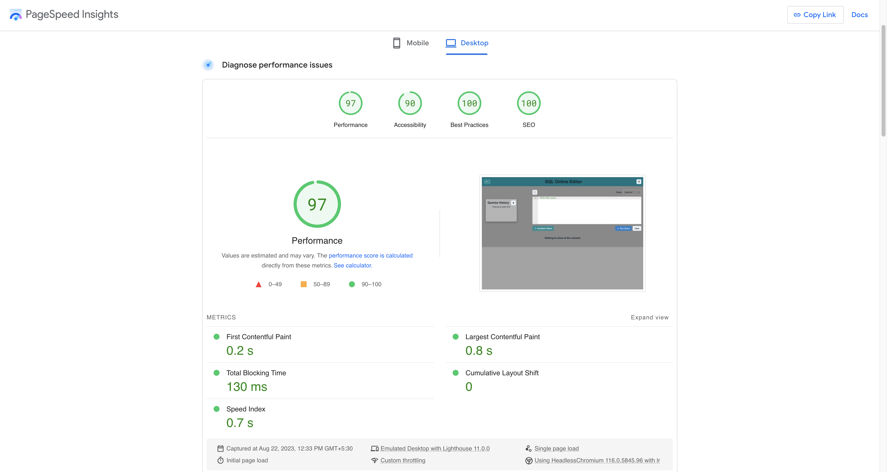
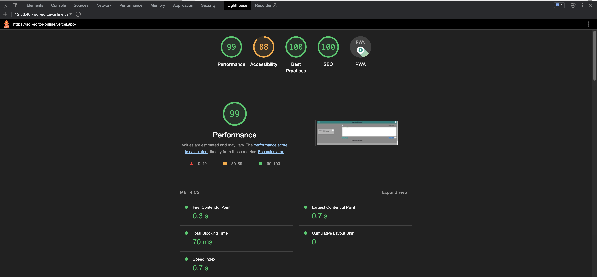

<h1 align="center">SQL Online Editor</h4>

<h4 align="center">"Craft SQL queries effortlessly in our intuitive online editor."</h4>

    <a href="https://sql-editor-online.vercel.app/" target="_blank">View Demo</a>
    ·
    <a href="https://github.com/janvi01/sql-editor/issues/new/choose" target="_blank">Report Bug</a>
    ·
    <a href="https://github.com/janvi01/sql-editor/issues/new/choose" target="_blank">Request Feature</a>

**SQL Online Editor** aims to provide users with a seamless and user-friendly platform for executing SQL queries, displaying query results in a table, maintaining a query history log, and supporting the export of results in CSV formats. The application will also provide a list of themes to change the editor UI and available tables in the sidebar for easy reference.

### Live : [https://sql-editor-online.vercel.app/](https://sql-editor-online.vercel.app/)

### Project Overview

## Key Features 📌

- **SQL Query Execution**: The application will allow users to input custom SQL queries and execute them against the connected database.

- **Result Tabular Display**: The application will present query results in a tabular format with a smooth scroll. This ensures that large datasets are easily navigable, enhancing the user experience.

- **Query History**: The application will maintain a history log of all executed queries. Users can revisit previous queries, and re-run them as needed.

- **Export Data**: Users will have the option to download query results in CSV format.

- **List of Available Tables**: The application's sidebar will display a list of available tables in the connected database.

- **Change Editor Theme and Size**: The user can change the theme of the Editor by selecting the option from the dropdown and expanding or shrinking the editor size.

## Techstack used 🛠️

The following technologies and libraries are used for the development of this
project.

- [React](https://react.dev/)
- [React Ace](https://github.com/securingsincity/react-ace)
- [Chakra UI](https://chakra-ui.com/)
- [React Icons](https://react-icons.github.io/react-icons/)
- [React-json-to-csv](https://github.com/coston/react-json-to-csv)
- [Prettier](https://prettier.io/)

## Demo Screenshots

## Performance

(Performance using [PageSpeed Insights](https://pagespeed.web.dev/))

(Performance using Chrome Devtools LightHouse)

### Optimisation

- Lazy loaded output display.
- No error logs to the console.
- Used Vercel for hosting.

## Community and Contributions

We warmly welcome all contributors! The Project is meant to build a community and it welcomes open collaboration. As you get started, please review this project's [contributing guidelines](https://github.com/janvi01/sql-editor/blob/main/CONTRIBUTING.md). Whether you are a user or code contributor and whether you're opening an [issue](https://github.com/janvi01/sql-editor/issues) or a [pull request](https://github.com/janvi01/sql-editor/pulls), know that any form of your engagement is considered a contribution and is appreciated. Contributors are expected to adhere to the **Code of Conduct**.

### Thanks to these wonderful Contributors 🌻

